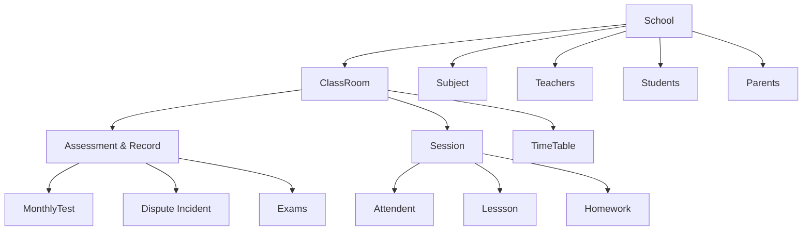

```mermaid


graph TD
A[School] --> B[ClassRoom]
A --> I[Subject]
A --> F[Teachers]
A --> D[Students]
A --> K[Parents]

B --> B1[Assessment & Record]
B --> B2[Session]
B --> B3[TimeTable]

B1 --> B11[MonthlyTest]
B1 --> B12[Dispute Incident]
B1 --> B13[Exams]

B2 --> B21[Attendent]
B2 --> B22[Lessson]
B2 --> B23[Homework]


```
